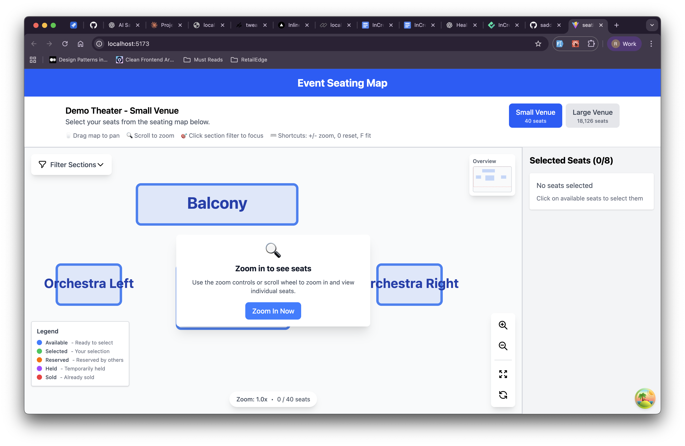
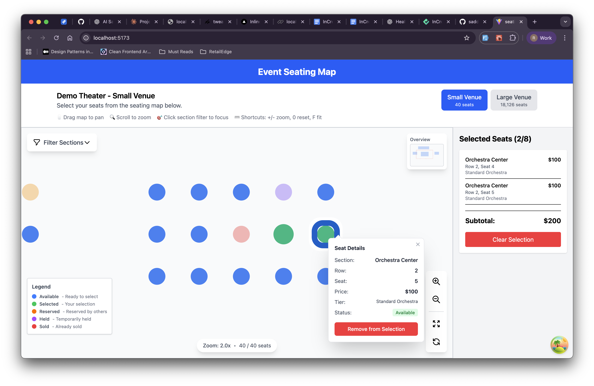
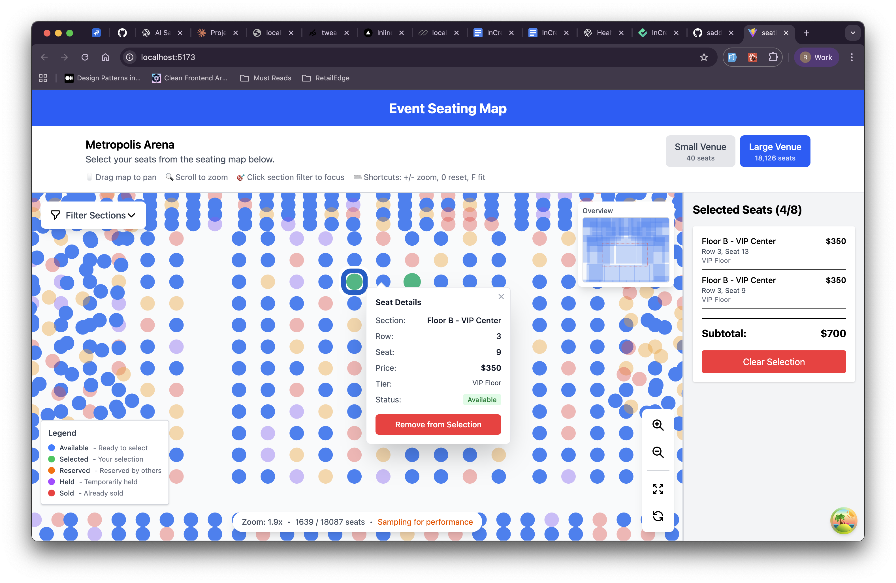

# Event Seating Map - Interactive Venue Seating Selection

A high-performance React + TypeScript application for interactive event seating selection, featuring real-time updates, viewport culling for 15,000+ seats, and persistent selection state.

## 🚀 Quick Start

```bash
pnpm install
pnpm dev
```

The application will start at `http://localhost:5173`

## 🏗️ Architecture & Design Decisions

### Core Architecture Principles

This application follows a **scalable, maintainable architecture** with clear separation of concerns:

#### 1. **Data Fetching Layer** (TanStack Query)
- **Why**: Industry-standard for server state management with built-in caching, retries, and devtools
- **Location**: `src/hooks/use-venue.ts`, `src/services/venue-service.ts`
- **Benefits**: 
  - Automatic background refetching
  - Cache management out of the box
  - Loading and error states handled declaratively
  - Optimistic updates ready for WebSocket integration

#### 2. **Client State Management** (Zustand)
- **Why**: Lightweight, performant, and supports middleware (persist)
- **Location**: `src/store/seat-store.ts`
- **Features**:
  - Seat selection state (max 8 seats)
  - LocalStorage persistence with Set serialization
  - Focus management for accessibility

#### 3. **Business Logic Layer**
- **Location**: `src/utils/seat-utils.ts`
- **Responsibilities**:
  - Seat flattening from nested structure
  - Viewport culling algorithm (for 15K+ seats)
  - Price calculations
  - Seat lookup utilities

#### 4. **Component Architecture**
```
src/
├── components/          # Presentational components
│   ├── seating-map.tsx  # SVG canvas with pan/zoom
│   ├── seat.tsx         # Memoized seat rendering
│   ├── seat-detail.tsx  # Modal for seat information
│   └── selection-summary.tsx # Cart summary
├── hooks/               # Custom hooks
│   ├── use-venue.ts     # TanStack Query hooks
│   └── use-selected-seats.ts # Derived seat details
├── services/            # API layer
│   └── venue-service.ts # Fetch venue data
├── store/               # Zustand stores
│   └── seat-store.ts    # Selection state
├── types/               # TypeScript definitions
│   └── venue.ts         # Domain models
└── utils/               # Pure utility functions
    └── seat-utils.ts    # Business logic
```

### Performance Optimizations

1. **Viewport Culling**: Only renders seats visible in the current viewport (+ 100px padding)
2. **React.memo**: Seat components are memoized to prevent unnecessary re-renders
3. **useMemo**: Heavy computations (flattening, filtering) are memoized
4. **Set for Selection**: O(1) lookups for selected seats

### Technology Choices

| Technology | Purpose | Why? |
|------------|---------|------|
| **TanStack Query** | Server state | Industry standard, rich ecosystem, devtools |
| **Zustand** | Client state | Lightweight, simple API, middleware support |
| **Tailwind CSS** | Styling | Rapid development, consistent design system |
| **TypeScript (strict)** | Type safety | Catches bugs at compile time, better DX |
| **Vite** | Build tool | Fast HMR, modern bundler |

## ✅ Requirements Checklist

### Core Requirements
- [x] Load `venue.json` and render all seats in correct positions
- [x] Smooth 60fps rendering for ~15,000 seats (viewport culling)
- [x] Mouse click and keyboard selection
- [x] Display seat details on click/focus
- [x] Select up to 8 seats with live summary and subtotal
- [x] Persist selection after page reload (localStorage)
- [x] Basic accessibility (aria-labels, focus, keyboard nav)
- [x] Desktop and mobile responsive layout

### Features Implemented
- ✅ Real-time data fetching with TanStack Query
- ✅ Seat detail modal with price tier information
- ✅ Viewport culling for optimal performance
- ✅ Pan (Shift+Drag) and Zoom (Mouse Wheel) controls
- ✅ State persistence with Zustand middleware
- ✅ Responsive design (mobile/desktop)
- ✅ Price tier display from venue data
- ✅ Seat status indicators (available, reserved, sold, held)

## Project display

### Small Venue View

*Interactive seating map showing a compact venue layout with clearly visible seat sections, pricing tiers, and selection capabilities*

### Detailed Seat View

*Close-up view of individual seats with interactive selection, hover states, and seat status indicators (available, reserved, sold, held)*

### Large Venue View

*Full-scale venue visualization demonstrating viewport culling performance with 15,000+ seats, pan and zoom controls for seamless navigation*

## 🔧 Development

### Project Structure
- **Components**: Presentational layer, UI logic only
- **Hooks**: Reusable stateful logic
- **Services**: Data fetching and external APIs
- **Store**: Global client state
- **Utils**: Pure functions, business logic
- **Types**: TypeScript definitions

## 📦 Build

```bash
pnpm build
pnpm preview
```

## 🧪 Testing

Tests can be added using:
- **Vitest** for unit tests
- **Playwright** for E2E tests
- **React Testing Library** for component tests
